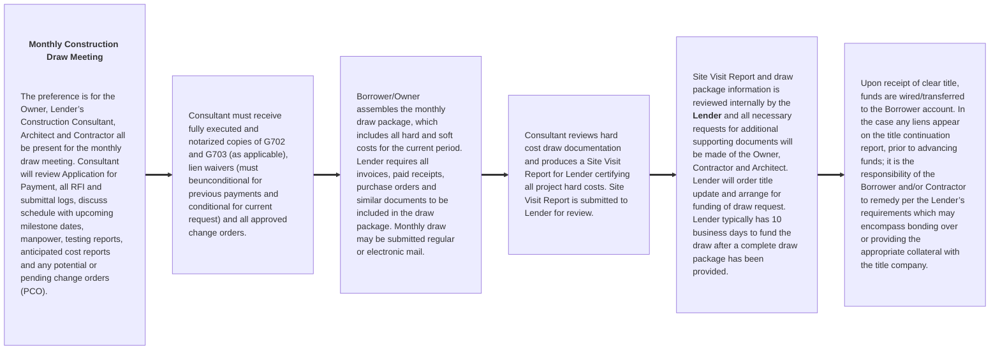

# Competent Draw Package Details

## I. GENERAL DISBURSEMENT CONDITIONS

In addition to any additional or other specific requirements as may be contained in the Lender loan agreement(s), the following shall be the general conditions precedent to funding construction loan advances for the Project:

### 1. Any Disbursement Subsequent to the Initial Disbursement

1. Lender shall have received satisfactory evidence that proceeds of any required equity contribution and/or subordinate debt (as applicable) have been disbursed and applied towards approved project costs in a manner acceptable to Lender and pursuant to the construction budget previously approved by the Lender.

2. Lender shall have received satisfactory evidence that proceeds of prior disbursements have been applied towards approved project costs in a manner acceptable to Lender and pursuant to the construction budget previously approved by Lender.

### 2. Each Subsequent Disbursement during the Course‐of‐Construction

1. Borrower shall not submit more than one funding requisition per calendar month.

2. Lender shall not be required to make any requested disbursement earlier than ten (10) Business Days after the receipt by Lender of the applicable funding requisition and all other items required (e.g acceptable Lender Construction Consultant Site Visit Report, and any additional back‐up documents or information as may be required by the Lender, in its sole discretion, as support for the requisitioned funds, etc.) pursuant to the loan agreement to accompany such funding requisition.

3. The Loan shall be "In Balance." The Loan is "In Balance" whenever the amount of the undisbursed construction loan proceeds and any other Borrower monies as shown in the most recent Lender approved construction budget, are sufficient in the reasonable judgment of Lender to pay all remaining hard costs, soft costs, and any other project costs, as may be applicable.

### 3. Post‐Closing Open Items/Special Conditions/ Required Document(s)

1. Advances are subject to Lender receiving all other required Project related documentation (as may be
   applicable) outlined in the loan agreement(s), in form and content acceptable to Lender, including but
   limited to the following: Budget, Architect Agreement, Contractor Agreement, CM Contract, Sub‐
   Contracts, Plans and Specs, Permits, Schedule, Bonds, Lien Waivers (monthly with each draw request),
   and any other documentation Lender may reasonably require in its sole discretion.

## II. CONSTRUCTION DRAW FUNDING FLOW

### Diagram

## III. CONSTRUCTION DRAW PACKAGE – REQUIRED FORMS

Each construction draw request package must include the documents listed in Table 1, below. Additional document(s) may be requested for submission by the Lender and/or Lender’s Construction Consultant, in order to support the review and processing of the requisition submitted by the Borrower.

Table 1 also lists the documents that are required when the draw request includes funding for Stored Materials and for the final Release of Retainage and Project Close‐Out.

All draw requests should be submitted to the Lender representative with a copy sent simultaneously to the Lender’s Construction Consultant. At the kick‐off meeting, please discuss a definitive method of delivery (courier or e‐mail) for the construction draw package each month, with your Lender representative.

### Table of Forms

| Exhibit | Document                               | Description                                            | Type        |
| :------ | :------------------------------------- | :----------------------------------------------------- | ----------- |
|         | **For Each Construction Advance/Draw** |
| A       | AlA Document G702                      | Contractor's Application and Certification For Payment | Sample Only |
| B       | AlA Document G702                      | Continuation Sheet                                     | Sample Only |
| C       | AlA Document G702                      | AlA Document G701                                      | Sample Only |
| D       | Lien Waiver(s)                         | Conditional/Unconditional                              | Form        |
| E       | Budget Reallocation Request            |                                                        | Form        |
| F       | Potential Change Order Log             |                                                        | Form        |
|         | **For Project Close‐Out**              |
| G       | Retainage Release                      | Includes Project Close‐Out Document Checklist          | Form        |
|         | **For Stored Materials**               |
| H       | Document Checklist                     |                                                        | Form        |
| H1      | Summary Log                            |                                                        | Form        |
| H2      | Bill of Sale                           |                                                        | Form        |
| H3      | Waiver of Consent                      |                                                        | Form        |

## IV. PREPARATION OF THE CONSTRUCTION DRAW PACKAGE

### 1. Advance Form

    The Borrower shall complete the Lender’s Request for Advance Form (“Advance Form”) as required by Lender
    (Lender to provide copy of Request for Advance Form to Borrower). The requisitioned amount should be broken
    down and delineate the project 'hard costs' and project 'soft costs' that sum to the total of the requisitioned
    amount. It is typical to identify all of the funding source(s) for the requisitioned funds. The requisitioned hard
    cost(s) stated on the Advance Form must equal the hard cost(s) amount approved and certified by the Architect
    on the AIA document G702. The Advance Form must be signed by an authorized Borrower representative, as set
    forth in the Loan Agreement.

### 2. Contractor's Application and Certification For Payment

AIA Documents G702 and G703 shall be used for all construction hard cost advance requests. Contractor must prepare and execute AIA G702 (see Exhibit A) and
G703 (see Exhibit B), detailing construction hard cost(s) in progress and payments requested to date. Although the Contractor prepares these documents, the Borrower, by certifying and including the AIA documents in the Disbursement Request Package, acknowledges its review and approval of all documents. AIA Document G702
must also be executed by the Architect, certifying the work outlined in the AIA documents. The AIA documents must also be notarized prior to submission to the Lender.

Note: No disbursement for hard costs will be made until the Lender’s Construction Consultant has completed a site inspection and Site Visit Report, and the Lender has reviewed and approved the funding request.

#### a. Stored Materials

    Please note that if the Lender has agreed to fund for Stored Materials, you will need to provide additional supporting documents necessary for processing funding for the same. Due to the lead time required to obtain some of these documents, particularly when there are several suppliers and contractors involved, we urge you to familiarize yourself with the Stored Materials Checklist (Exhibit H), early in the process. If the required documentation is not provided, the request for stored materials funding may not be approved.

    Documents required to support funding for stored materials should include:

    1. A Stored Materials Summary Log that lists the stored materials, for which funding is being requested (see Exhibit H.1).
    2. A Stored Materials Bill of Sale for the stored materials which funding is being requested (see Exhibit H.2).
    3. An executed Stored Materials Waiver and Consent in case the materials for which funding is being requested, is stored off‐site (Exhibit H.3)
    4. Any additional supporting docs that the Lender’s Construction Consultant may require. This typically includes, but is not limited to: detailed invoice(s), pictures w/project name and updated insurance certificate w/Lender(s) named as additional insured.

#### b. Retainage

    During the course‐of‐construction, retainage will be withheld, according to the terms set forth in the Loan Agreement. Typically, retainage for each Construction Contract is the greater of (a) ten percent (10%) of all amounts required to be paid to any Contractor under a Construction Contract until Borrower has achieved substantial completion of the construction or rehabilitation, as the case may be, of the Improvements as determined by Lender; provided, however, that upon the consent of Lender, in Lender's sole discretion, at 50% completion of the Improvements (as determined by Lender’s Construction Consultant) retainage may be reduced; or (b) the actual retainage required under such Construction Contract. Please also refer to “Retainage” section of the Loan Agreement for specific retainage requirements associated with your loan and additional information on retainage. If project is bonded, a Consent of Surety shall accompany each request for retainage reduction.

#### c. Budget Reallocation/Change Orders (AIA Document G701)

    All requests for change orders must be submitted on a standard AIA G701 (see Exhibit C), which must be executed by the Contractor, Architect and the Owner. For each change order submitted on an AIA G701, to request a reallocation from any line item within the hard cost budget, including from the hard‐cost contingency line, the Lender requires that such reallocation be listed on the Budget Reallocation Request (Exhibit E).

    The Budget Reallocation Request lists all of the requested reallocations for hard cost(s) categorized by budget line item to indicate (i) the specific cost category/line item from which you are requesting funds, (ii) the amount requested for reallocation, (iii) the cost category to which the reallocated funds are to be applied, (iv) the invoice amount, and (v) the explanation for each requested change, per the `Explanation Codes' provided in the legend of the form. Change order work shall not commence until change order(s) has been approved by all parties, as required in the loan agreement. Change Order(s) are subject to the requirements contained in the loan agreement.

    The Lender does not allow for budget line items to be overdrawn. It is important to note that a project Hard CosT Contingency must be provided for, outside of the construction contract. Typically, so long as no Event of Default has occurred and is continuing under the loan documents, and all other terms and conditions for a disbursement have been satisfied, and subject to Lender approval and any other requirements as may be contained in the loan documents(s), the Borrower may be permitted to reallocate funds from the "Hard Cost Contingency" line to other hard cost budget line items, in amount(s) proportionate to the percentage of construction completed, as the case may be.

    :::tip Example:
    If the percentage of construction completed is twenty percent (20%), as determined by Lender and the
    Construction Consultant, then Borrower may be permitted to reallocate not more than twenty percent (20%) of the original
    "Hard Cost Contingency" line item amount (determined on a cumulative basis, taking into account any previous draws from
    the "Contingency" line item).
    :::

#### d. Partial Waiver of Lien

    A Partial Waiver of Lien (Exhibit D) must be completed in accordance with the local or
    state requirements. Lender requires that the Borrower submit, with each construction draw request package
    (subsequent to the initial draw request), an unconditional lien waiver for previous payments received and a
    conditional lien waiver for the current advance request. Lump Sum contracts (A101 contracts) require only lien
    waivers from the General Contractor. Cost plus or GMP contracts require lien waivers from the CM/GC and all
    major subcontractors (as determined by Lender). Also, an alphabetical listing of all subcontractors must be
    supplied, which includes a detailed listing of the unconditional and conditional payments for each subcontractor.
    Note: all contracts must be fully executed prior to release of payment to contractors, subcontractors or vendors.

#### e. Potential Change Order (PCO)

    A potential change order (Exhibit F) can be an item you expect or anticipate might result in extra work, or additional costs. A PCO can also result from owner directives, clarifications or changes to the original plans. A PCO log is important when attempting to anticipate project change orders.

#### f. Release of Retainage/Project Close‐Out

    Release of Retainage occurs after Substantial Completion and must be approved by the Lender’s Construction Consultant. Prior to the final release of retainage, the following information may be required (see below). We recommend that you collect this information as each individual subcontract is closed‐out, rather than wait till the end of the project when it may take considerable time to collect all information.

:::info Conditions

-   All required “As‐Built” Plans and Drawings have been submitted and approved;
-   Warranties, guarantees, keys, owner and maintenance manuals have been accepted by the Owner;
-   Satisfactory documentation and evidence showing all required testing (and results thereof) of mechanical and electrical systems has been performed;
-   A complete punch list, approved by Borrower and Contractor, acceptable to Lender. To the extent punch list items have not been completed, an amount equal to a minimum of 150% of the value of such items
    shall be withheld by Lender pending receipt of evidence showing satisfactory completion;
-   Final lien waivers from all contractors and subcontractors; - AIA G707 ‐ Consent of Surety to Final Payment ‐ (as applicable) - LEED certification documents ‐ (as applicable).
    :::

        In addition, additional documents may be required by the Lender in order to Close‐Out a project. Please refer to `Final Disbursement’ section of the Loan Agreement for additional details.

        The Retainage Release and Project Close‐Out Checklist (Exhibit G) attached hereto has been provided for your reference. Additional information may be required pursuant to your loan agreement.

## V. Other General Disbursement Matters

### 1. Site Inspections by Lender’s Construction Consultant

A site inspection is conducted by the Lender’sConstruction Consultant prior to approving each subsequent draw. In order for the Lender’s Construction Consultant to prepare the required Site Visit Report, the Borrower/Contractor must submit the following documents (at a minimum) to the Lender’s Consultant at each site visit and meeting:

:::info Submission List

-   An updated Construction Schedule ‐ The schedule should be reviewed and any upcoming milestones/ potential delays should be discussed at the construction draw meeting.
-   Pending Change Order Logs and or Anticipated Cost Reports‐ should be provided and discussed with the Lender’s Consultant.
-   Testing Reports‐ should be reviewed and copies of deficient tests must be provided to the Lender’s Consultant. Also, satisfactory closure to any deficient items must be provided by the Architect, Engineering or Testing Agency.
-   Updated Plans, Specifications and Addendums, when issued.
-   Shop Drawings and RFI Logs‐ should be available for review by the Lender’s Consultant.
    :::

### 2. Insurance

As a condition precedent to each subsequent disbursement, the Borrower is required to maintain effective coverage for all applicable insurance(s), as required per loan documents. If any required coverage is expired, advances/funding may be withheld.

### 3. Title Continuation Letter

As a condition precedent to each subsequent disbursement, the Bank will acquire a title continuation as of the date of funding. If the title continuation returns any reports of liens on the subject mortgaged property, advances/funding may be withheld. The Borrower/Contractor will be responsible to either settle any liens or provide the appropriate protection (typically bonding or putting up a LC) before funds will be released.
