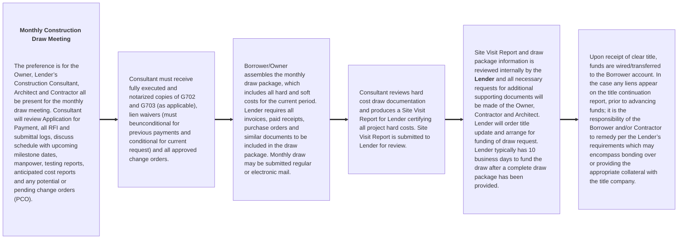

# CDP Flow Diagram

```mermaid

graph LR


A@{label: "
<div >
    <div style='font-weight: bold;text-wrap:wrap;'>Monthly Construction Draw Meeting</div>
    <div style='text-wrap: wrap;text-align:left;font-size:12pt;'>
        The preference is for the Owner, Lender’s Construction Consultant, Architect and Contractor all be present for the monthly draw meeting. Consultant will review Application for Payment, all RFI and submittal logs, discuss schedule with upcoming milestone dates, manpower, testing reports, anticipated cost reports and any potential or pending change orders (PCO).<br/><br/>
    </div>
</div>"}

A==>B


B@{label: "
<div style='text-wrap: wrap;text-align:left;font-size:12pt;'>
  Consultant must receive fully executed and notarized copies of G702 and G703 (as applicable), lien waivers (must beunconditional for previous payments and conditional for current request) and all approved change orders.<br/><br/>
 </div>"}

B==>C

C@{label: "
  <div style='text-wrap: wrap;text-align:left;font-size:12pt;'>
    Borrower/Owner assembles the monthly draw package, which includes all hard and soft costs for the current period. Lender requires all invoices, paid receipts, purchase orders and similar documents to be included in the draw package. Monthly draw may be submitted regular or electronic mail.<br/><br/>
    </div>"}

C==>D

D@{label: "
<div style='text-wrap: wrap;text-align:left;font-size:12pt;'>
  Consultant reviews hard cost draw documentation and produces a Site Visit Report for Lender certifying all project hard costs. Site Visit Report is submitted to Lender for review.<br/><br/>
</div>"}

D==>E

E@{label: "
<div style='text-wrap: wrap;text-align:left;font-size:12pt;'>
  Site Visit Report and draw package information is reviewed internally by the **Lender** and all necessary requests for additional supporting documents will be made of the Owner, Contractor and Architect. Lender will order title update and arrange for funding of draw request. Lender typically has 10 business days to fund the draw after a complete draw package has been provided.<br/><br/>
</div>"}

E==>F

F@{label: "
<div style='text-wrap: wrap;text-align:left;font-size:12pt;'>
  Upon receipt of clear title, funds are wired/transferred to the Borrower account. In the case any liens appear on the title continuation report, prior to advancing funds; it is the responsibility of the Borrower and/or Contractor to remedy per the Lender’s requirements which may encompass bonding over or providing the appropriate collateral with the title company.<br/><br/>
</div>"}

```
