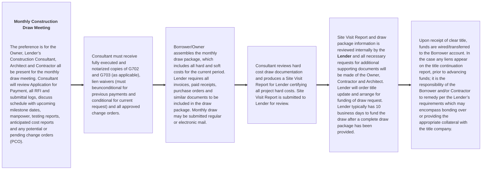

# Competent Draw Package Details

## I. GENERAL DISBURSEMENT CONDITIONS

In addition to any additional or other specific requirements as may be contained in the Lender loan agreement(s), the following shall be the general conditions precedent to funding construction loan advances for the Project:

### A. Any Disbursement Subsequent to the Initial Disbursement

1. Lender shall have received satisfactory evidence that proceeds of any required equity contribution and/or subordinate debt (as applicable) have been disbursed and applied towards approved project costs in a manner acceptable to Lender and pursuant to the construction budget previously approved by the Lender.

2. Lender shall have received satisfactory evidence that proceeds of prior disbursements have been applied towards approved project costs in a manner acceptable to Lender and pursuant to the construction budget previously approved by Lender.

### B. Each Subsequent Disbursement during the Course‐of‐Construction

1. Borrower shall not submit more than one funding requisition per calendar month.

2. Lender shall not be required to make any requested disbursement earlier than ten (10) Business Days after the receipt by Lender of the applicable funding requisition and all other items required (e.g acceptable Lender Construction Consultant Site Visit Report, and any additional back‐up documents or information as may be required by the Lender, in its sole discretion, as support for the requisitioned funds, etc.) pursuant to the loan agreement to accompany such funding requisition.

3. The Loan shall be "In Balance." The Loan is "In Balance" whenever the amount of the undisbursed construction loan proceeds and any other Borrower monies as shown in the most recent Lender approved construction budget, are sufficient in the reasonable judgment of Lender to pay all remaining hard costs, soft costs, and any other project costs, as may be applicable.

### C. Post‐Closing Open Items/Special Conditions/ Required Document(s)

1. Advances are subject to Lender receiving all other required Project related documentation (as may be
   applicable) outlined in the loan agreement(s), in form and content acceptable to Lender, including but
   limited to the following: Budget, Architect Agreement, Contractor Agreement, CM Contract, Sub‐
   Contracts, Plans and Specs, Permits, Schedule, Bonds, Lien Waivers (monthly with each draw request),
   and any other documentation Lender may reasonably require in its sole discretion.

## II. CONSTRUCTION DRAW FUNDING FLOW

## III. CONSTRUCTION DRAW PACKAGE – REQUIRED FORMS

Each construction draw request package must include the documents listed in Table 1, below. Additional document(s) may be requested for submission by the Lender and/or Lender’s Construction Consultant, in order to support the review and processing of the requisition submitted by the Borrower.

Table 1 also lists the documents that are required when the draw request includes funding for Stored Materials and for the final Release of Retainage and Project Close‐Out.

All draw requests should be submitted to the Lender representative with a copy sent simultaneously to the Lender’s Construction Consultant. At the kick‐off meeting, please discuss a definitive method of delivery (courier or e‐mail) for the construction draw package each month, with your Lender representative.

| Exhibit | Document                               | Description                                            | Type        |
| :------ | :------------------------------------- | :----------------------------------------------------- | ----------- |
|         | **For Each Construction Advance/Draw** |
| A       | AlA Document G702                      | Contractor's Application and Certification For Payment | Sample Only |
| B       | AlA Document G702                      | Continuation Sheet                                     | Sample Only |
| C       | AlA Document G702                      | AlA Document G701                                      | Sample Only |
| D       | Lien Waiver(s)                         | Conditional/Unconditional                              | Form        |
| E       | Budget Reallocation Request            |                                                        | Form        |
| F       | Potential Change Order Log             |                                                        | Form        |
|         | **For Project Close‐Out**              |
| G       | Retainage Release                      | Includes Project Close‐Out Document Checklist          | Form        |
|         | **For Stored Materials**               |
| H       | Document Checklist                     |                                                        | Form        |
| H1      | Summary Log                            |                                                        | Form        |
| H2      | Bill of Sale                           |                                                        | Form        |
| H3      | Waiver of Consent                      |                                                        | Form        |
